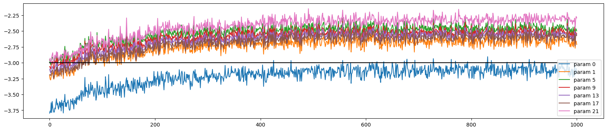

# mini-models

This repository comprises several implemented models. Currently, the included models are:

- A Neural Probabilistic Language Model - https://www.jmlr.org/papers/volume3/bengio03a/bengio03a.pdf
- Bigram

## Journey of the Input

Welcome to the world of input. I, a humble character, word, or token, embark on an epic journey of neural circuitry, a creation inspired by human intellect. To step into this realm, I must undergo a magical transformation into what's known as one hot encoding. Imagine me as an array of `0s` and `1s`, where I stand out uniquely, marked by my position in this digital lineup. The visual description of the network is provided at the end of this story.

Picture my two pals (yes, we're a trio of characters) and me as adventurous explorers entering the vast neural landscape. This trio is also referred to as context length or block size in geeky circles.

Our first adventure is a makeover session, where our one hot encoding is jazzed up into a more sophisticated look known as embedding. Here's how it works: each performs a secret handshake, or a lookup, in the embedding table (let's call it `C`), and voilà – we get our new, dense representations. This table is like a wardrobe of possibilities, initially filled with random ensembles `torch.randn((vocab_size, emb_size))`. There are 27 characters in our world, and each character gets an outfit (vector) of size 10.

Think of the embedding layer as a unique neural layer but without any fancy nonlinear fashion statements. Once we're all decked out in our embedding attire, we collectively present ourselves as a stunning array of 30 inputs (3 characters times 10).

Each neuron is like a discerning audience, receiving a show of `[len(X), 3, 10]` - the number of examples, inputs, and the size of each character's outfit. We've evolved in shape and style! Each neuron is equipped to handle 30 inputs, with weights `W1 = torch.randn((input_size, num_neurons))` and biases `b1 = torch.randn((num_neurons))` tailored to match. The bias is like adding a dash of positivity to each neuron's perception.

The next step is straightforward yet intriguing. We apply `emb @ W1 + b1` to reveal the first layer's output. But wait! If you're puzzled here, take a detour to the mini-autograd for clarity. Sometimes, the matrix multiplication plays poorly due to mismatched shapes - it's like trying to fit a square peg in a round hole.

To fix this, I need to flatten myself – and it's not about flattery, but transformation. We can use `torch.cat` to merge our inputs, reshaping the emb matrix from torch.Size([182437, 3, 10]) to torch.Size([182437, 30]). It's like blending our styles into a cohesive fashion statement. A more elegant method here is `emb.view(182437, 30)`, which automatically adjusts our arrangement without the need to manually combine each element.
After this transformation, we can successfully apply `emb @ W1 + b1`. The output of the first layer is then refined with a dash of non-linearity, like adding a twist to our tale with a function like tanh - it's the squash to our pumpkin!

As we gear up for the next layer, the plot thickens. The input to each neuron in the second layer equals the number of neurons in the first layer. The grand finale of this layer is an output vector size matching our ouput/vocabulary, which is 27 in our world. `e.g. logits = h @ self.W2 + self.b2`

Now comes the moment of truth: calculating the loss, comparing our predictions with reality `e.g. loss = F.cross_entropy(logits, Ytr[ix])`. It's like a game show where we guess and check, with cross-entropy scoring our performance. PyTorch makes it a breeze (think of it as having an expert judge). It is nothing but exponentiating the logits and normalizing over dimension one, and then we take negative log likelihood.

The stars of our show are the trainable parameters `[self.C, self.W1, self.b1, self.W2, self.b2]`.

Finally, we wrap up our adventure with a backward pass and updating parameters. For the nitty-gritty details, peek into the network class, which is as enlightening as the mini-autograd library. Following is the plots for - numbers of steps vs loss,

### Model training based on different parameters

### Following is the neural circuitry described above

## Understanding Losses

`Relationship between Training and Validation Loss`

`Overfitting`: If the training loss continues to decrease but the validation loss begins to increase, the model is likely overfitting the training data. It means the model is learning patterns specific to the training data, which do not generalize well to new, unseen data.

`Underfitting`: If both training and validation loss are high or if the training loss is much higher than typically expected, it suggests underfitting. The model is not learning the underlying patterns in the data well enough.

`Ideal Scenario`: Ideally, both training and validation losses should decrease to a point of stability with a minimal gap between the two. This suggests that the model has learned the patterns in the training data well and is also generalizing well to new data.

`Early Stopping`: Early stopping is a technique where training is stopped when the validation loss stops decreasing (and especially if it starts to increase). This prevents overfitting and ensures the model retains its generalization ability.

## Optimizations, one step at a time

1. Large loss for first mini batch: It can be clearly observed that loss at the first step is high, logits for the first minibatch are so random. Ideally, they should be equally distributed for all characters or vocabulary (27). In other words, the logits are indicating that the probability of one of the chars, say 'd', is .8, whereas at the very beginning, the network should put equal probability to the outcomes i.e. -torch.tensor(1/27).log = 3.29

    1. step 1 will be to make b2 bias '0' at the initialization time.
    2. step 2 will be to initialize W2 with small values, scaled down. Dont set this to zero.
    
    *Refer: `model_3 notebook`*

2. Squashing function problem (tanh): The network has a problem with the 'h', hidden states. The purpose of tanh, as we remember, is to squash the values between -1 and 1; let's look at the histogram of the hidden states, h.shape is 32 (batch size)(examples), and 200 is the hidden size. The first thing to do is to stretch the h to one large vector h.view(-1).shape # 6400 is the batch size * hidden size. Now lets view the histogram,
`plt.hist(h.view(-1).tolist(), 50)`

   

    Above, observe how the values are squashed between -1 and 1. The biggest problem here is that the more the values are in the flat region of the tanh, i.e. -1 and 1, the grad will be zero, which means that the network will not learn anything or loss is not affected by those neurons. Ref: Autograd (1 - t**2). Also if the value is zero, the grad is just passed through, which means tanh is not doing anything.
    
    How do we solve this problem? We need to bring the hpreact values closer to zero so that tanh is not in the flat region. To do so, we multiply the hpreact with a small number, which is called scaling and the same with bias.

   *Refer: `model_3 notebook`*

    After you apply changes, observe how the values are between -20 and 20, we bring them to -2 and 2 by scaling, `plt.hist(hpreact.view(-1).tolist(), 50)`

   

    Let's look at 32 examples and 200 neurons. All the white ones are where the value is > 0.99, so h is in flat areas, meaning that the grad is zero for those neurons, tanh is not doing anything (gradients are destroyed). What is important to note is that no column is all white because, in that case, we have dead neurons.

    This happens with all activation functions, relu, sigmoid, etc. Some neurons get knocked off forever and are dead, and they are not learning anything.

   

3. It is not a good idea or practically possible to manually set the scale-down factor for the weights and biases. We can fix this by scaling down the weights, but how much should we scale down? The answer is to scale down by the square root of the input size (fan-in). We can use the kaiming_normal_ function, where mode='fan_in' scales down by the square root of the input size, and mode='fan_out' scales down by the square root of the output size. Choosing 'fan_in' preserves the magnitude of the variance of the weights in the forward pass. `Choosing 'fan_out' preserves the magnitudes (grad) in the backwards pass. Ultimately, you either normalise the activations or the gradients`.

    Read more: https://arxiv.org/pdf/1502.01852.pdf

    #### Example - https://pytorch.org/docs/stable/nn.init.html 
    For the Following gaussian distribution, the standard deviation is 1. Spread of the distribution is 1.\
    `torch.randn(1000).std()`
    
    Observe that multiplying by 0.2 reduces the spread of the distribution to 0.2, this is where we need to use kaiming initialization = gain/squareroot.\
    `(torch.randn(1000) * 0.2).std()`

    Kaiming initialization,\
    `(5/3) / (n_emb * block_size) ** 0.5`

    

4. `Our essential goal` is to keep the preactivation neither too small nor too large, so the best thing to do is instead of using the Kaiming function, we can use batch normalization to make the preactivation Gaussian with mean 0 and variance 1 so that the tanh is not in the flat region. Simple yet powerful.\
`Batch normalize` (perfect guassian) the preactivations, mainly during the initialization time. For other times, we want the network to have varying preactivations/distributions (learning time),i.e. bngain and bnbias are learnable parameters, they are initialized to 1 and 0 respectively, and they are updated during the training process
\
`Batch normalization, because of its batch nature, has this regularization effect`. It is not a regularizer, but it has a regularizing effect, i.e. each example is normalized concerning the batch, 'h' does gitter a little bit, which means that the network will not overfit to the one example or specific example.\
`For the testing purpose`, we need to keep the running mean and running std, calculated on the side, this is important because we may want to test with single example.

    Read more: https://arxiv.org/pdf/1502.03167.pdf

    

## Neural Network: From Implementation to Insight

Let us implement the neural network like in PyTorch, which has linear, BachNorm, and Tanh layers. To optimize the neural network's behaviour, it's essential to visualize the effects of the kaiming function and batch normalization on activations.

We implement three classes: `Linear, BatchNorm1d, and Tanh` 

In the Linear layer, we initialize the weights and biases, where the fan in and fan out define the input and output size, e.g. in the first layer, we have 30 inputs and 100 neurons (outputs), 30 is the no. of inputs, a.k.a block or context size multiplied by embedding size. Here, we divide the weights by the square root of the fan in (kaiming function), which is done in this pre-activation layer to ensure the values are scaled down before they go into the tanh layer, done to ensure that the squashed values are not in the regions of -1, 1, 0 because we can then face a gradient diminishing problem. We are trying to keep the distribution during pre-activation as smooth as possible with a std of 1 and a mean of 0. Secondly, biases may not be needed because we will apply beta later, a.k.a shift/bias, when we do batch normalization. The best is to keep bias as an optional parameter. The call function performs the linear operation, and the parameters function keeps track of all trainable parameters.

In the BatchNorm1d layer, we initialize it with epsilon, momentum, gamma, beta, and running mean and variance. Look at the batch norm paper for details of this formula. Epsilon is used in the denominator to avoid division with zero, a tiny number. Conversely, momentum is used to maintain the running mean and variance of the batches in each run. Running mean and variance are later used at the inferencing time. This is a.k.a training the running mean and variance with momentum update.
The call function takes the input batch x; during training, it takes the mean and variance of the x, whereas during inferencing, it uses the running mean and variance. The first step is calculating x-hat, normalizing to unit variance, i.e. transform x to `x-hat = (x - x-mean) / torch.sqrt(xvar + self.eps)`. We then scale the x-hat and shift by adding bias, i.e. `self.out = self.gamma * xhat + self.beta`. Once the scale/shift is done, we calculate the running mean and variance if under training. The learnable parameters here are only gamma and beta.

The tanh operation is performed in the Tanh layer.

Using the above layers, define your neural network. I created a six-layer network. Make sure you define the dataset, embedding size, and hidden size and initialize C, which is the embedding matrix.

Let's assume we don't use batch normalization and rely on the kaiming function. The first thing we do is ensure the last layer is not confident, which means that all the logits have the same probability as an outcome during the first time. This is done using `layers[-1].weight *= 0.1`
For all the other layers, we will apply the gain to each `layer.weight *= 5/3`, 5/3 comes from kaiming function. When we use batch normalization, we use `layers[-1].gain *= 0.1` to make the last layer unconfident.

Finally, perform the Optimization.

Visualization
Here, we visualize the layers, specifically the tanh layers (1, 3, 5, 7, 9), as they are more controllable data to visualize, and we can see the mean, std, and the percentage of saturated neurons `t = layer.out`. Saturated here means how many neurons are close to -1 or 1, which is a sign of vanishing gradients, i.e., the mean of t.abs() is > .97. What we observe with gain 5/3 is that the mean is close to 0, and the std is close to 1, and the percentage of saturated neurons is close to 0, which is a good sign. Initially, saturation is 20, i.e., a bit high, but it decreases with more layers. It's important to understand that if it were alone linear layers, the square root of fan_in above would have maintained the std to 1. Things would be good through all linear layers, but as we have tanh layers in between, which keep squashing the distribution, we need to keep adding some gain, like 5/3, to maintain the std to 1. If you consider the linear layers, commenting out the tanh layers, we will need to change the 5/3 gain to 1 because there is no non-linearity (squashing) from the tanh.

Side note: Why do we need tanh layers? If we just have linear layers stacked, the transformation is just a linear transformation, and we can just have one linear layer to do the same job. The tanh layers add non-linearity to the network, making it more expressive and, in principle, moving from a linear function to a more non-linear function.

Now, let's visualize the gradients, i.e. `t = layer.out.grad`. An Important observation is that the gradients are not moving around for each layer; they are fairly constant.

Above, we visualized the layers and their gradients. Now, let's look at the Weighted Gradient distributions, i.e. `t = p.grad`, where p has a dimension of 2 (not considering all trainable parameters but only weights). We mainly look at the shape of the t, mean, and std and the ratio of grad to the data, i.e. grad:data. 
The grad:data is the scale of the gradients to the scale of the data. The gradients are exploding if the gradient is a very high number compared to the data. It is not good because `p.data += -lr * p.grad.data` will not work well. The amount of p.data will become very high if p.grad.dat is very high. In the last layer, the gradient's magnitudes are very high compared to the data(see below), indicating exploding gradients. SGD will only be ideal for some. The best is Adam. 

Let us track and visualize the update to data ratio, modified above.
The plot shows that the last layer update is very high compared to the data, which is a sign of exploding gradients. This mainly happened because we made the last layer less confident. -3 is the ideal ratio value, meaning the update is 1/1000 of the data. Play with parameters to get the ratio to -3.

*To put it simply, we start by examining the layer output. This gives us information about the kaiming function, which consists of gain and the square root of fan-in. It helps us prevent the diminishing gradient problem, which is when neurons stop learning. If we don't use kaiming and instead use batch normalization, we can still avoid this problem. We can experiment with different values and normalization techniques to see how the graph changes. It's essential to keep track of the mean, standard deviation, and saturation in particular. Secondly, we can also look at how the layer gradients are performing and how they change if we change the values or normalization techniques. Precisely track the mean and standard deviation. It should be consistent and not move around too much. Thirdly, we start looking at the gradients of the learnable parameters, mainly weights. It gets interesting here: if gradient values are high, the data value of the weight parameters becomes high. This is not good, as it now leads to an exploding gradient problem.*

## Usage

To use any of the models, navigate to the respective directory under the `src` directory and follow the instructions provided in the README file.

For neural langauge model, simply use the main.py and try your luck with new parameters. 
All the plots for loss and training performance files are available under `params_loss_plots` and `train_perf` respectively.

TODO: Add details for generation of text, More description about losses.

## Inspiration

*Model implementations, so profoundly inspired by Andrej Karpathy's legendary work in neural networks, 
it practically owes him a coffee. Karpathy, the neural network whisperer, whose innovative approaches are so clear, they make quantum physics look like a children's bedtime story. 
Thanks to him, our understanding of deep learning has leaped more than a caffeinated kangaroo in a trampoline park!*

## License

This project is licensed under the MIT License. See the [LICENSE](LICENSE) file for more information.
