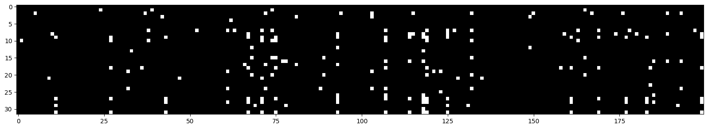

# mini-models

This repository comprises several implemented models. Currently, the included models are:

- A Neural Probabilistic Language Model - https://www.jmlr.org/papers/volume3/bengio03a/bengio03a.pdf
- Bigram

## Journey of the Input

Welcome to the world of input. I, a humble character, word, or token, embark on an epic journey of neural circuitry, a creation inspired by human intellect. To step into this realm, I must undergo a magical transformation into what's known as one hot encoding. Imagine me as an array of `0s` and `1s`, where I stand out uniquely, marked by my position in this digital lineup. The visual description of the network is provided at the end of this story.

Picture my two pals (yes, we're a trio of characters) and me as adventurous explorers entering the vast neural landscape. This trio is also referred to as context length or block size in geeky circles.

Our first adventure is a makeover session, where our one hot encoding is jazzed up into a more sophisticated look known as embedding. Here's how it works: each performs a secret handshake, or a lookup, in the embedding table (let's call it `C`), and voilà – we get our new, dense representations. This table is like a wardrobe of possibilities, initially filled with random ensembles `torch.randn((vocab_size, emb_size))`. There are 27 characters in our world, and each character gets an outfit (vector) of size 10.

Think of the embedding layer as a unique neural layer but without any fancy nonlinear fashion statements. Once we're all decked out in our embedding attire, we collectively present ourselves as a stunning array of 30 inputs (3 characters times 10).

Each neuron is like a discerning audience, receiving a show of `[len(X), 3, 10]` - the number of examples, inputs, and the size of each character's outfit. We've evolved in shape and style! Each neuron is equipped to handle 30 inputs, with weights `W1 = torch.randn((input_size, num_neurons))` and biases `b1 = torch.randn((num_neurons))` tailored to match. The bias is like adding a dash of positivity to each neuron's perception.

The next step is straightforward yet intriguing. We apply `emb @ W1 + b1` to reveal the first layer's output. But wait! If you're puzzled here, take a detour to the mini-autograd for clarity. Sometimes, the matrix multiplication plays poorly due to mismatched shapes - it's like trying to fit a square peg in a round hole.

To fix this, I need to flatten myself – and it's not about flattery, but transformation. We can use `torch.cat` to merge our inputs, reshaping the emb matrix from torch.Size([182437, 3, 10]) to torch.Size([182437, 30]). It's like blending our styles into a cohesive fashion statement. A more elegant method here is `emb.view(182437, 30)`, which automatically adjusts our arrangement without the need to manually combine each element.
After this transformation, we can successfully apply `emb @ W1 + b1`. The output of the first layer is then refined with a dash of non-linearity, like adding a twist to our tale with a function like tanh - it's the squash to our pumpkin!

As we gear up for the next layer, the plot thickens. The input to each neuron in the second layer equals the number of neurons in the first layer. The grand finale of this layer is an output vector size matching our ouput/vocabulary, which is 27 in our world. `e.g. logits = h @ self.W2 + self.b2`

Now comes the moment of truth: calculating the loss, comparing our predictions with reality `e.g. loss = F.cross_entropy(logits, Ytr[ix])`. It's like a game show where we guess and check, with cross-entropy scoring our performance. PyTorch makes it a breeze (think of it as having an expert judge). It is nothing but exponentiating the logits and normalizing over dimension one, and then we take negative log likelihood.

The stars of our show are the trainable parameters `[self.C, self.W1, self.b1, self.W2, self.b2]`.

Finally, we wrap up our adventure with a backward pass and updating parameters. For the nitty-gritty details, peek into the network class, which is as enlightening as the mini-autograd library. Following is the plots for - numbers of steps vs loss,

### Model training based on different parameters

### Following is the neural circuitry described above

## Understanding Losses

`Relationship between Training and Validation Loss`

`Overfitting`: If the training loss continues to decrease but the validation loss begins to increase, the model is likely overfitting the training data. It means the model is learning patterns specific to the training data, which do not generalize well to new, unseen data.

`Underfitting`: If both training and validation loss are high or if the training loss is much higher than typically expected, it suggests underfitting. The model is not learning the underlying patterns in the data well enough.

`Ideal Scenario`: Ideally, both training and validation losses should decrease to a point of stability with a minimal gap between the two. This suggests that the model has learned the patterns in the training data well and is also generalizing well to new data.

`Early Stopping`: Early stopping is a technique where training is stopped when the validation loss stops decreasing (and especially if it starts to increase). This prevents overfitting and ensures the model retains its generalization ability.

## Optimizations, one step at a time

1. Large loss for first mini batch: It can be clearly observed that loss at the first step is high, logits for the first minibatch are so random. Ideally, they should be equally distributed for all characters or vocabulary (27). In other words, the logits are indicating that the probability of one of the chars, say 'd', is .8, whereas at the very beginning, the network should put equal probability to the outcomes i.e. -torch.tensor(1/27).log = 3.29

    1. step 1 will be to make b2 bias '0' at the initialization time.
    2. step 2 will be to initialize W2 with small values, scaled down. Dont set this to zero.
    
    *Refer: `model_3 notebook`*

2. Squashing function problem (tanh): The network has a problem with the 'h', hidden states. The purpose of tanh, as we remember, is to squash the values between -1 and 1; let's look at the histogram of the hidden states, h.shape is 32 (batch size)(examples), and 200 is the hidden size. The first thing to do is to stretch the h to one large vector h.view(-1).shape # 6400 is the batch size * hidden size. Now lets view the histogram,
`plt.hist(h.view(-1).tolist(), 50)`

   

    Above, observe how the values are squashed between -1 and 1. The biggest problem here is that the more the values are in the flat region of the tanh, i.e. -1 and 1, the grad will be zero, which means that the network will not learn anything or loss is not affected by those neurons. Ref: Autograd (1 - t**2). Also if the value is zero, the grad is just passed through, which means tanh is not doing anything.
    
    How do we solve this problem? We need to bring the hpreact values closer to zero so that tanh is not in the flat region. To do so, we multiply the hpreact with a small number, which is called scaling and the same with bias.

   *Refer: `model_3 notebook`*

    After you apply changes, observe how the values are between -20 and 20, we bring them to -2 and 2 by scaling, `plt.hist(hpreact.view(-1).tolist(), 50)`

   

    Let's look at 32 examples and 200 neurons. All the white ones are where the value is > 0.99, so h is in flat areas, meaning that the grad is zero for those neurons, tanh is not doing anything (gradients are destroyed). What is important to note is that no column is all white because, in that case, we have dead neurons.

    This happens with all activation functions, relu, sigmoid, etc. Some neurons get knocked off forever and are dead, and they are not learning anything.

   

3. It is not a good idea or practically possible to manually set the scale-down factor for the weights and biases. We can fix this by scaling down the weights, but how much should we scale down? The answer is to scale down by the square root of the input size (fan-in). We can use the kaiming_normal_ function, where mode='fan_in' scales down by the square root of the input size, and mode='fan_out' scales down by the square root of the output size. Choosing 'fan_in' preserves the magnitude of the variance of the weights in the forward pass. `Choosing 'fan_out' preserves the magnitudes (grad) in the backwards pass. Ultimately, you either normalise the activations or the gradients`.

    Read more: https://arxiv.org/pdf/1502.01852.pdf

    #### Example - https://pytorch.org/docs/stable/nn.init.html 
    For the Following gaussian distribution, the standard deviation is 1. Spread of the distribution is 1.\
    `torch.randn(1000).std()`
    
    Observe that multiplying by 0.2 reduces the spread of the distribution to 0.2, this is where we need to use kaiming initialization = gain/squareroot.\
    `(torch.randn(1000) * 0.2).std()`

    Kaiming initialization,\
    `(5/3) / (n_emb * block_size) ** 0.5`

    

## Usage

To use any of the models, navigate to the respective directory under the `src` directory and follow the instructions provided in the README file.

For neural langauge model, simply use the main.py and try your luck with new parameters. 
All the plots for loss and training performance files are available under `params_loss_plots` and `train_perf` respectively.

TODO: Add details for generation of text, More description about losses.

## Inspiration

*Model implementations, so profoundly inspired by Andrej Karpathy's legendary work in neural networks, 
it practically owes him a coffee. Karpathy, the neural network whisperer, whose innovative approaches are so clear, they make quantum physics look like a children's bedtime story. 
Thanks to him, our understanding of deep learning has leaped more than a caffeinated kangaroo in a trampoline park!*

## License

This project is licensed under the MIT License. See the [LICENSE](LICENSE) file for more information.
